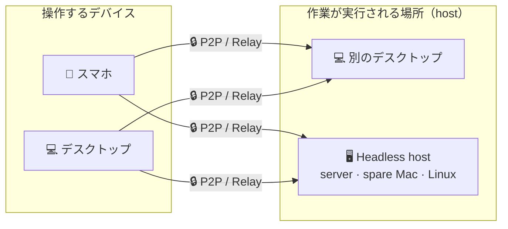

<p align="center">
  
</p>

<h1 align="center">Codux</h1>

<p align="center">
  <b>AI コーディングのための高性能ターミナル：デスクトップ、スマホ、サーバーをひとつのワークスペースへ</b><br/>
  <b>Rust + GPUI</b> で作られた Codux は、Codex、Claude Code、8 種類以上の AI コーディング CLI を統合し、ライブ状態、トークン分析、ローカルメモリ、認証情報を隔離した SSH / データベースアクセス、長時間実行中の agent 作業をどこからでも引き継げる暗号化デバイスリンクを提供します。
</p>

<p align="center">
  <a href="https://github.com/duxweb/codux/releases/latest"></a>
  <a href="https://github.com/duxweb/codux/releases"></a>
  
  <a href="LICENSE"></a>
  <a href="https://github.com/duxweb/codux/stargazers"></a>
</p>

<p align="center">
  <a href="https://codux.dux.cn">Web サイト</a> &middot;
  <a href="https://codux.dux.cn/zh-cn/getting-started/">ドキュメント</a> &middot;
  <a href="https://github.com/duxweb/codux/releases/latest">ダウンロード</a> &middot;
  <a href="https://github.com/duxweb/codux-flutter/releases/latest">モバイル</a> &middot;
  <a href="https://github.com/duxweb/codux/issues">フィードバック</a>
</p>

<p align="center">
  <a href="README.md">English</a> | <a href="README.zh-CN.md">简体中文</a> | 日本語 | <a href="README.ko.md">한국어</a>
</p>

---


https://github.com/user-attachments/assets/cabf21a9-8649-4e65-9e8a-db27ccaccdf3

<p align="center">
  <a href="https://github.com/user-attachments/assets/cabf21a9-8649-4e65-9e8a-db27ccaccdf3">▶ デモを見る</a>
</p>

## Codux を使う理由

AI コーディング CLI は非常に強力ですが、制御を失いやすい道具でもあります。実際の作業は、プロジェクト、Git worktree、ターミナル、セッション、トークン、リモート shell、そして思い出しきれないコンテキストに散らばります。**Codux はその混乱を、真剣な AI コーディングのための安定したネイティブワークスペースにまとめます。**

| AI コーディングで起きがちな問題 | Codux が提供するもの |
| :--- | :--- |
| AI CLI ごとに状態が分かれる | Codex、Claude Code、OpenCode、Kiro CLI、Kimi Code、CodeWhale、MiMo Code、Agy を横断するプロジェクト中心のビュー。 |
| 長時間の agent 実行を再開しにくい | ライブ状態、ローカル履歴、セッション復元、worktree に追従するコンテキスト。 |
| 並行作業が衝突する | worktree ファーストのモデル。各タスクが専用のターミナル、Git 状態、ファイル、AI セッションを持ちます。 |
| トークン消費が見えない | ツール、モデル、プロジェクト、worktree、日付ごとの使用量を可視化。表計算は不要です。 |
| セッション間で文脈が消える | 習慣、プロジェクトプロファイル、モジュールメモをローカルに保存し、対応 CLI に自動注入。 |
| 認証情報がプロンプトに入ってしまう | 保存済み・テスト済みの SSH / データベースプロファイルと、agent が使える `codux-ssh` / `codux-db` コマンド。**認証情報をモデルに見せません**。 |
| 席を離れると作業を監視できない | スマホを P2P / リレーリンクでペアリングし、どこからでも同じセッションを操作。 |
| コードが別マシンにある | サーバー、予備の Mac、Linux ボックスなどの headless host に接続し、ローカルのようにターミナル、Git、AI を操作。 |

Codux は新しいエディタではありません。AI コーディング CLI を日常的に使う開発者のための制御プレーンであり、複数プロジェクトと長時間 agent 作業を安定して扱うための道具です。

## クイックスタート

macOS： [Homebrew](https://brew.sh) でインストールします。

```bash
brew install --cask duxweb/tap/codux
```

1. **プロジェクトを開く。** Git worktree、プロジェクト状態、プロジェクトごとのセッションが自動で読み込まれます。
2. **内蔵ターミナルで AI CLI を起動する。** `codex`、`claude`、`opencode` などを実行します。非侵襲の wrapper がライブ状態、トークン追跡、メモリ注入をゼロ設定で有効にします。
3. **席を離れても続ける。** スマホまたは headless host を一度ペアリングすれば、どこからでも同じ実行中セッションを引き継げます。

Windows、または Homebrew を使わない場合は [ダウンロード](#download) を参照してください。

## 認証情報は AI に届きません

agent はサーバーやデータベースを頻繁に必要とします。しかし、パスワードをプロンプトに貼ったり、モデルに設定ファイルを読ませたりすることは、認証情報漏えいの原因になります。Codux は接続プロファイルをローカルに保存し、agent には安全な 2 つのコマンドだけを渡します。

- **`codux-ssh`**：agent は `codux-ssh list` を実行し、プロファイル名とホストだけを見ます。パスワードや鍵は Codux の helper プロセス内で注入され、モデルのコンテキスト、会話ログ、shell 履歴には入りません。
- **`codux-db`**：MySQL / PostgreSQL / SQLite でも同じ隔離を提供します。Codux に一度保存し、プロファイル名で問い合わせます。読み取り専用プロファイルは wrapper 内の単一ステートメント allowlist で強制されるため、モデルが自分で権限を広げることはできません。
- **プロジェクトごとの設定は不要。** 対応 CLI は Codux の環境ディレクティブからこれらのコマンドを自動で認識します。

<p align="center"></p>

## AI CLI サポート

Codux は非侵襲の wrapper とツールごとの adapter を使います。Codux のコンテキストを注入するために、プロジェクト内へ prompt ファイルを書いたり、AI CLI のグローバル設定を書き換えたりしません。

| AI CLI | ライブ状態 | トークン使用量 | モデル設定 | フルアクセスモード | 環境ディレクティブ |
| :--- | :---: | :---: | :---: | :---: | :--- |
| Codex | ✓ | ✓ | ✓ | ✓ | developer instructions 経由で対応 |
| Claude Code / reclaude | ✓ | ✓ | ✓ | ✓ | `--append-system-prompt` 経由で対応 |
| OpenCode | ✓ | ✓ | ✓ | ✓ | 管理プラグイン設定経由で対応 |
| MiMo Code | ✓ | ✓ | ✓ | ✓ | 管理プラグイン設定経由で対応 |
| Kimi Code | ✓ | ✓ | ✓ | — | 管理 `--agent-file` 経由で対応 |
| Kiro CLI | ✓ | ✓ | ✓ | ✓ | 注入なし。確認済みの非侵襲 prompt channel はありません |
| CodeWhale | ✓ | ✓ | ✓ | ✓ | interactive session では注入なし |
| Agy | ✓ | ✓ | ✓ | ✓ | 注入なし。確認済みの非侵襲 prompt channel はありません |

環境ディレクティブには Codux メモリに加えて、`codux-ssh` や `codux-db` などの runtime コマンドが含まれます。未対応ツールでも可能な範囲でセッション追跡を行いますが、プロジェクトファイルやユーザーレベル設定を強制的に使った prompt 注入は行いません。

## ひとつのワークスペース、すべてのデバイス

> **Beta.** headless host への接続は、このリリースではまず beta として提供されます。接続、ペアリング、host 側データフローはまだ検証中のため、荒い部分が残る可能性があります。フィードバックを歓迎します。

デスクトップ、スマホ、headless host は、エンドツーエンド暗号化された **P2P / リレーリンク** 上の peer として動作します。長時間の agent 実行をどこからでも操作できます。

- **可能な限り直接接続。** Codux は P2P 経路を優先し、ネットワーク条件に応じてリレーへフォールバックします。
- **SSH リモートデスクトップではありません。** 一度デバイスをペアリングすれば、Codux 自体へ直接接続します。
- **公開 IP は不要。** デスクトップ、スマホ、host は家庭、オフィス、モバイル回線の一般的なネットワーク越しにペアリング・再接続できます。



controller である **デスクトップ** または **スマホ** は、host である **別のデスクトップ** または **headless host** に接続できます。デスクトップは両方の役割を持ち、自分のプロジェクトを host しながら他の host も操作できます。スマホは操作専用です。作業は host マシン上に残るため、デバイスを切り替えてもセッションは中断されません。

- **スマホへの引き継ぎ。** 数秒でペアリングし、同じターミナル、履歴、AI セッションをスマホから継続できます。
- **Headless host。** サーバー、予備の Mac、Linux ボックスで `codux` を実行し、ローカルのようにターミナル、Git、AI を操作できます。詳しくは [`apps/agent/README.md`](apps/agent/README.md) を参照してください。
- **セッション継続。** 切断後も同じ実行中 shell と agent セッションに再接続できます。

## ターミナルペット

agent が消費するすべてのトークンは、ワークスペースに住むピクセルペットの成長につながります。孵化させ、名前を付け、コーディングとともにレベルアップする様子を眺められます。5 つのステータス（Wisdom、Chaos、Night、Stamina、Empathy）は、あなたが実際にどのように、いつ作業したかから成長します。カスタム sprite ペットをインストールしたり、古い仲間を殿堂入りさせたりできます。

役には立たない。でも、なくてはならない。

<p align="center"></p>

## ローカルファースト設計

- **データはあなたのもの。** プロジェクト、ターミナル、セッション、メモリ、トークン統計、認証情報はあなたのマシンに残ります。Codux cloud もアカウント登録もありません。
- **暗号化されたデバイスリンク。** デスクトップ ⇄ スマホ ⇄ host の通信はエンドツーエンド暗号化されます。直接 P2P が使えない場合でも、リレーは暗号文だけを転送します。
- **原則として非侵襲。** Codux はリポジトリに prompt ファイルを書かず、AI CLI のグローバル設定も変更しません。すべてのコンテキスト注入は、確認可能な wrapper と adapter 経由で行います。

## Download

**デスクトップアプリ**

macOS： [Homebrew](https://brew.sh) でインストールします。

```bash
brew install --cask duxweb/tap/codux
```

または直接ダウンロードできます。

| プラットフォーム | ダウンロード |
| :--- | :--- |
| macOS · Apple Silicon | [⬇ `codux-macos-aarch64.dmg`](https://github.com/duxweb/codux/releases/latest/download/codux-macos-aarch64.dmg) |
| macOS · Intel | [⬇ `codux-macos-x86_64.dmg`](https://github.com/duxweb/codux/releases/latest/download/codux-macos-x86_64.dmg) |
| Windows 11 · x64 | [⬇ `codux-windows-x86_64-setup.exe`](https://github.com/duxweb/codux/releases/latest/download/codux-windows-x86_64-setup.exe) |

macOS では `.dmg` を開いて Codux を Applications にドラッグします。Windows ではインストーラをダブルクリックします。その後、プロジェクトを開き、AI CLI を起動すれば使えます。

**モバイルアプリ**

[最新の Codux Mobile リリース](https://github.com/duxweb/codux-flutter/releases/latest) からダウンロードしてください。

**Headless host (`codux-agent`)**：Beta、2.0 で提供

macOS / Linux：1 行でインストールできます（OS / arch を自動判定し、`codux` として `PATH` に配置します）。

```bash
curl -fsSL https://raw.githubusercontent.com/duxweb/codux/main/apps/agent/scripts/install.sh | sh
```

Flags：`--beta` · `--version <x.y.z>` · `--dir <path>` · `--setup` · `--mirror <prefix>`（GitHub が遅い地域向け）· `--uninstall`。またはバイナリを直接ダウンロードできます。

| プラットフォーム | ダウンロード |
| :--- | :--- |
| macOS · Apple Silicon | [⬇ `codux-macos-aarch64`](https://github.com/duxweb/codux/releases/latest/download/codux-macos-aarch64) |
| macOS · Intel | [⬇ `codux-macos-x86_64`](https://github.com/duxweb/codux/releases/latest/download/codux-macos-x86_64) |
| Linux · arm64 | [⬇ `codux-linux-aarch64`](https://github.com/duxweb/codux/releases/latest/download/codux-linux-aarch64) |
| Linux · x64 | [⬇ `codux-linux-x86_64`](https://github.com/duxweb/codux/releases/latest/download/codux-linux-x86_64) |
| Windows · x64 | [⬇ `codux-windows-x86_64.exe`](https://github.com/duxweb/codux/releases/latest/download/codux-windows-x86_64.exe) |

バイナリを `codux` という名前で `PATH` に置き、`codux config` → `codux install` → `codux qrcode` を実行します。

詳細は `codux <command> --help`、または [`apps/agent/README.md`](apps/agent/README.md) を参照してください。

<details>
<summary><b>Headless host の全コマンド</b></summary>

| コマンド | 内容 |
| :--- | :--- |
| `codux config` | 対話式セットアップ（デバイス名、リレー）。`codux.toml` を書き込みます。 |
| `codux install` | 起動サービスとして登録します（launchd / `systemd --user` / Task Scheduler）。 |
| `codux start` / `stop` | host を起動（foreground）または停止します。 |
| `codux status` | 実行状態、node id、ペアリング済みデバイス数を表示します。 |
| `codux qrcode` / `link` | ペアリング QR を表示、またはデスクトップに貼るペアリング ticket を出力します。 |
| `codux device` | ペアリング済みデバイスを一覧表示。`device:del <id>` / `device:rename <id>` / `device:clear` で管理します。 |
| `codux update` | このバイナリをダウンロード、検証、置換し、host を再起動します。 |
| `codux uninstall` | サービスを停止して削除します。 |

</details>

## Web Tunnel Browser

ペアリング済み headless host を Codux Desktop から操作しているとき、地球アイコンの **Web Tunnel Browser** ボタンは、host としてブラウズする proxy 隔離 Chromium を開きます。host で Vite が `http://127.0.0.1:5173/` を実行している場合、その URL を入力すると暗号化された Codux link 経由で開きます。HTTPS、WebSocket、HMR、LAN アドレス、`.local` 名、VPN ルートにも対応します。

<details>
<summary><b>診断とメモ</b></summary>

- host-local URL は controller マシンではなく host 上で解決されます。
- すべての `codux-agent` は `http://127.0.0.1:8765/` に組み込み診断ページを提供します。Web Tunnel Browser で開くと、tunnel の状態と live round-trip latency を確認できます。
- 1 台のコンピュータでのテストでも同じ tunnel 経路を通りますが、真のクロスマシン到達性は別マシン上の Codux host で確認してください。

</details>

## キーボードショートカット

| アクション | ショートカット |
| :--- | :--- |
| 新しい分割 | `⌘T` |
| 新しいタブ | `⌘D` |
| Git パネル切り替え | `⌘G` |
| AI パネル切り替え | `⌘Y` |
| プロジェクト切り替え | `⌘1` – `⌘9` |

すべて **Settings → Shortcuts** でカスタマイズできます。

## システム要件

**デスクトップアプリ**

- macOS 14.0 (Sonoma) 以降
- Windows 11

**Headless host (`codux-agent`)**

- macOS、Linux、Windows（x86_64 と arm64）

## フィードバック

バグ報告や機能要望は [GitHub Issues](https://github.com/duxweb/codux/issues) に投稿してください。

バグ報告時は **Help → Export Diagnostics** を使い、生成された `.zip` を添付することを推奨します。runtime logs、rotated logs、performance summaries、保存済み app state、invalid-state backups、該当する macOS diagnostic reports が含まれます。

手動ログパス：

- `~/Library/Application Support/Codux/logs/runtime-rust.log`
- `~/Library/Application Support/Codux/logs/performance-summary.json`
- `%APPDATA%\Codux\logs\runtime-rust.log`

---

## Community Support

Codux は [LINUX DO](https://linux.do) コミュニティを応援しています。

## Contributors

Codux にコード、issue、テスト、フィードバックで貢献してくれたすべての方に感謝します。

<p align="center">
  <a href="https://github.com/duxweb/codux/graphs/contributors">
    
  </a>
</p>

## GitHub Star Trend

Codux が長時間 agent 実行を救ったことがあるなら、⭐ がより多くの人に見つけてもらう助けになります。

[](https://star-history.com/#duxweb/codux&Date)

<p align="center">
  本当は dmux という名前にしたかったのですが、すでに使われていました。だから Codux になりました。中国語では「Cool Dux」のように聞こえます。
</p>

<p align="center">
  <a href="https://codux.dux.cn">codux.dux.cn</a>
</p>
