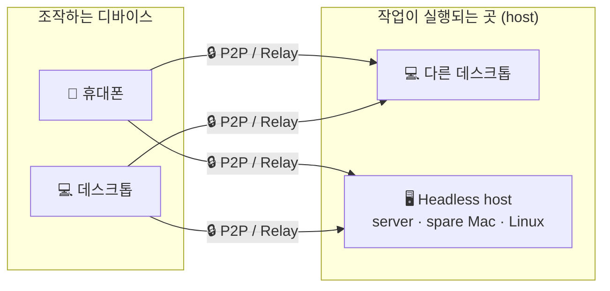
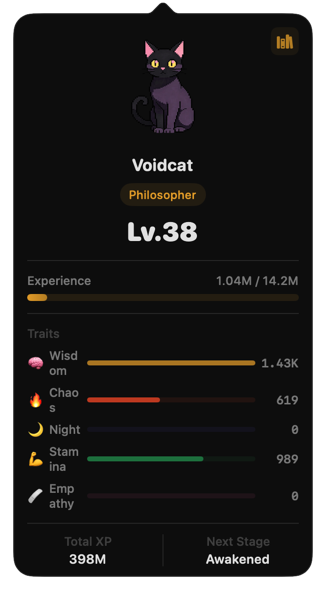

<p align="center">
  
</p>

<h1 align="center">Codux</h1>

<p align="center">
  <b>AI 코딩을 위한 고성능 터미널: 데스크톱, 휴대폰, 서버를 하나의 워크스페이스로</b><br/>
  <b>Rust + GPUI</b> 로 만든 Codux는 Codex, Claude Code, 8개 이상의 AI 코딩 CLI를 통합하고, 실시간 agent 상태, 토큰 분석, 로컬 메모리, 자격 증명이 격리된 SSH / 데이터베이스 접근, 장시간 실행 중인 agent 작업을 어디서든 이어받을 수 있는 암호화된 디바이스 링크를 제공합니다.
</p>

<p align="center">
  <a href="https://github.com/duxweb/codux/releases/latest"></a>
  <a href="https://github.com/duxweb/codux/releases"></a>
  
  <a href="LICENSE"></a>
  <a href="https://github.com/duxweb/codux/stargazers"></a>
</p>

<p align="center">
  <a href="https://codux.work">웹사이트</a> &middot;
  <a href="https://codux.work/getting-started/">문서</a> &middot;
  <a href="https://github.com/duxweb/codux/releases/latest">다운로드</a> &middot;
  <a href="https://github.com/duxweb/codux-flutter/releases/latest">모바일</a> &middot;
  <a href="https://github.com/duxweb/codux/issues">피드백</a>
</p>

<p align="center">
  <a href="README.md">English</a> | <a href="README.zh-CN.md">简体中文</a> | <a href="README.ja.md">日本語</a> | 한국어
</p>

---


https://github.com/user-attachments/assets/cabf21a9-8649-4e65-9e8a-db27ccaccdf3

<p align="center">
  <a href="https://github.com/user-attachments/assets/cabf21a9-8649-4e65-9e8a-db27ccaccdf3">▶ 데모 보기</a>
</p>

## Codux가 필요한 이유

AI 코딩 CLI는 매우 강력하지만, 통제하기 어려워지기도 쉽습니다. 실제 작업은 프로젝트, Git worktree, 터미널, 세션, 토큰, 원격 shell, 그리고 어렴풋이 기억나는 컨텍스트 사이에 흩어집니다. **Codux는 이 혼란을 진지한 AI 코딩을 위한 안정적인 네이티브 워크스페이스로 정리합니다.**

| AI 코딩에서 자주 생기는 문제 | Codux가 제공하는 것 |
| :--- | :--- |
| AI CLI마다 상태가 따로 있음 | Codex, Claude Code, OpenCode, Kiro CLI, Kimi Code, CodeWhale, MiMo Code, Agy를 아우르는 프로젝트 중심 뷰. |
| 긴 agent 실행을 이어가기 어려움 | 실시간 상태, 로컬 히스토리, 세션 복원, worktree를 따라가는 컨텍스트. |
| 병렬 작업이 서로 충돌함 | worktree-first 모델. 각 작업은 자체 터미널, Git 상태, 파일, AI 세션을 유지합니다. |
| 토큰 사용량이 보이지 않음 | 도구, 모델, 프로젝트, worktree, 날짜별 사용량. 스프레드시트가 필요 없습니다. |
| 세션 사이에 컨텍스트가 사라짐 | 습관, 프로젝트 프로필, 모듈 메모를 로컬에 저장하고 지원되는 CLI에 자동 주입합니다. |
| 자격 증명이 프롬프트에 들어감 | 저장 및 테스트된 SSH / 데이터베이스 프로필과 agent가 사용할 수 있는 `codux-ssh` / `codux-db` 명령. **자격 증명은 모델에 보이지 않습니다**. |
| 자리를 비우면 작업을 이어가기 어려움 | 휴대폰을 P2P / relay 링크로 페어링하고 어디서든 같은 세션을 조작합니다. |
| 코드가 다른 머신에 있음 | 서버, 여분의 Mac, Linux 박스 같은 headless host에 연결해 로컬처럼 터미널, Git, AI를 조작합니다. |
| Windows 프로젝트가 WSL에 있음 | 설치된 WSL 배포판을 Codux의 네이티브 실행 환경으로 사용해 파일, Git, worktree, 터미널, AI 세션을 Linux 안에 유지합니다. |

Codux는 또 하나의 에디터가 아닙니다. AI 코딩 CLI를 생활처럼 쓰는 개발자를 위한 제어 평면이며, 여러 프로젝트와 장시간 agent 작업을 안정적으로 다루기 위한 도구입니다.

## 빠른 시작

macOS: [Homebrew](https://brew.sh) 로 설치합니다.

```bash
brew install --cask duxweb/tap/codux
```

1. **프로젝트를 엽니다.** Git worktree, 프로젝트 상태, 프로젝트별 세션이 자동으로 준비됩니다.
2. **내장 터미널에서 AI CLI를 시작합니다.** `codex`, `claude`, `opencode` 등을 실행하세요. non-invasive wrapper가 실시간 상태, 토큰 추적, 메모리 주입을 별도 설정 없이 활성화합니다.
3. **자리를 비워도 계속합니다.** 휴대폰이나 headless host를 한 번 페어링하면 어디서든 같은 실행 중 세션을 이어받을 수 있습니다.

Windows 또는 Homebrew를 쓰지 않는 경우 [다운로드](#download)를 참고하세요.

## 자격 증명은 AI에 전달되지 않습니다

agent는 서버와 데이터베이스가 자주 필요합니다. 하지만 비밀번호를 프롬프트에 붙여 넣거나 모델이 설정 파일을 읽게 하는 것은 자격 증명 유출로 이어집니다. Codux는 연결 프로필을 로컬에 저장하고 agent에는 안전한 두 명령만 제공합니다.

- **`codux-ssh`**: agent는 `codux-ssh list` 를 실행해 프로필 이름과 호스트만 봅니다. 비밀번호와 키는 Codux helper 프로세스 안에서 주입되며, 모델 컨텍스트, 대화 기록, shell 히스토리에 들어가지 않습니다.
- **`codux-db`**: MySQL / PostgreSQL / SQLite에도 같은 격리를 제공합니다. Codux에 한 번 저장하고 프로필 이름으로 쿼리합니다. 읽기 전용 프로필은 wrapper 내부의 단일 문장 allowlist로 강제되므로 모델이 스스로 권한을 확장할 수 없습니다.
- **프로젝트별 설정이 필요 없습니다.** 지원되는 모든 CLI는 Codux 환경 지시문을 통해 이 명령들을 자동으로 알게 됩니다.

<p align="center"></p>

## AI CLI 지원

Codux는 non-invasive wrapper와 도구별 adapter를 사용합니다. Codux 컨텍스트를 주입하기 위해 프로젝트 prompt 파일을 쓰거나 AI CLI의 전역 설정을 바꾸지 않습니다.

| AI CLI | 실시간 상태 | 토큰 사용량 | 모델 설정 | 전체 접근 모드 | 환경 지시문 |
| :--- | :---: | :---: | :---: | :---: | :--- |
| Codex | ✓ | ✓ | ✓ | ✓ | developer instructions 경유 |
| Claude Code / reclaude | ✓ | ✓ | ✓ | ✓ | `--append-system-prompt` 경유 |
| OpenCode | ✓ | ✓ | ✓ | ✓ | 관리형 플러그인 설정 경유 |
| MiMo Code | ✓ | ✓ | ✓ | ✓ | 관리형 플러그인 설정 경유 |
| Kimi Code | ✓ | ✓ | ✓ | — | 관리형 `--agent-file` 경유 |
| Kiro CLI | ✓ | ✓ | ✓ | ✓ | 주입하지 않음. 확인된 non-invasive prompt channel 없음 |
| CodeWhale | ✓ | ✓ | ✓ | ✓ | interactive session에는 주입하지 않음 |
| Agy | ✓ | ✓ | ✓ | ✓ | 주입하지 않음. 확인된 non-invasive prompt channel 없음 |

환경 지시문에는 Codux 메모리와 `codux-ssh`, `codux-db` 같은 runtime 명령이 포함됩니다. 지원되지 않는 도구도 가능한 범위에서 세션을 추적하지만, 프로젝트 파일이나 사용자 전역 설정을 강제로 사용해 prompt를 주입하지 않습니다.

## 하나의 워크스페이스, 모든 디바이스

> **Beta.** headless host 연결은 이번 릴리스에서 먼저 beta로 제공됩니다. 연결, 페어링, host 측 데이터 흐름은 아직 활발히 테스트 중이므로 거친 부분이 있을 수 있습니다. 피드백을 환영합니다.

데스크톱, 휴대폰, headless host는 모두 종단 간 암호화된 **P2P / relay 링크** 위의 peer로 동작합니다. 긴 agent 실행을 어디서든 계속 조작할 수 있습니다.

- **가능하면 직접 연결.** Codux는 P2P 경로를 우선하고, 네트워크가 필요로 하면 relay로 fallback합니다.
- **SSH 원격 데스크톱이 아닙니다.** 디바이스를 한 번 페어링한 뒤 Codux 자체에 바로 연결합니다.
- **공인 IP가 필요 없습니다.** 데스크톱, 휴대폰, host는 일반 가정, 사무실, 모바일 네트워크에서도 페어링하고 재연결할 수 있습니다.



controller인 **데스크톱** 또는 **휴대폰**은 host인 **다른 데스크톱** 또는 **headless host**에 연결할 수 있습니다. 데스크톱은 두 역할을 모두 가집니다. 자신의 프로젝트를 host하면서 다른 host도 조작할 수 있습니다. 휴대폰은 조작만 합니다. 작업은 host 머신에 남아 있으므로 디바이스를 바꿔도 세션은 끊기지 않습니다.

- **휴대폰 handoff.** 몇 초 만에 페어링하고 같은 터미널, 히스토리, AI 세션을 휴대폰에서 이어갈 수 있습니다.
- **Headless host.** 서버, 여분의 Mac, Linux 박스에서 `codux`를 실행하고 로컬처럼 터미널, Git, AI를 조작합니다. [`apps/agent/README.md`](apps/agent/README.md)를 참고하세요.
- **세션 연속성.** 연결이 끊긴 뒤에도 같은 실행 중 shell과 agent 세션에 다시 연결할 수 있습니다.

## 터미널 펫

agent가 소비하는 모든 토큰은 워크스페이스에 사는 픽셀 펫을 성장시킵니다. 부화시키고, 이름을 붙이고, 코딩하면서 레벨업하는 모습을 지켜보세요. 다섯 가지 능력치(Wisdom, Chaos, Night, Stamina, Empathy)는 실제로 언제, 어떻게 작업하는지에서 자랍니다. 커스텀 sprite 펫을 설치하거나 오래된 동료를 명예의 전당에 보낼 수도 있습니다.

쓸모없지만, 꼭 필요합니다.

<p align="center"></p>

## Local-First 설계

- **데이터는 사용자의 것입니다.** 프로젝트, 터미널, 세션, 메모리, 토큰 통계, 자격 증명은 사용자의 머신에 남습니다. Codux cloud도 계정 가입도 없습니다.
- **암호화된 디바이스 링크.** 데스크톱 ⇄ 휴대폰 ⇄ host 트래픽은 종단 간 암호화됩니다. 직접 P2P가 불가능할 때도 relay는 암호문만 전달합니다.
- **원칙적으로 프로젝트를 건드리지 않습니다.** Codux는 리포지토리에 prompt 파일을 쓰지 않고 AI CLI의 전역 설정도 바꾸지 않습니다. 모든 컨텍스트 주입은 검토 가능한 wrapper와 adapter를 통해 이루어집니다.

## Download

**데스크톱 앱**

macOS: [Homebrew](https://brew.sh) 로 설치합니다.

```bash
brew install --cask duxweb/tap/codux
```

또는 직접 다운로드하세요.

| 플랫폼 | 다운로드 |
| :--- | :--- |
| macOS · Apple Silicon | [⬇ `codux-macos-aarch64.dmg`](https://github.com/duxweb/codux/releases/latest/download/codux-macos-aarch64.dmg) |
| macOS · Intel | [⬇ `codux-macos-x86_64.dmg`](https://github.com/duxweb/codux/releases/latest/download/codux-macos-x86_64.dmg) |
| Windows 11 · x64 | [⬇ `codux-windows-x86_64-setup.exe`](https://github.com/duxweb/codux/releases/latest/download/codux-windows-x86_64-setup.exe) |

macOS에서는 `.dmg`를 열고 Codux를 Applications로 드래그합니다. Windows에서는 설치 프로그램을 더블 클릭합니다. 그런 다음 프로젝트를 열고 AI CLI를 시작하면 됩니다.

**Windows + WSL.** **설정 → WSL**에서 연동을 켜고 배포판을 설치하거나 선택한 뒤 Codux Runtime을 한 번에 설치·업데이트할 수 있습니다. 프로젝트를 추가할 때 해당 WSL 배포판 안의 디렉터리를 선택하면 파일, Git, worktree, 터미널, AI 세션이 자동으로 WSL을 통해 실행됩니다.

**모바일 앱**

[최신 Codux Mobile 릴리스](https://github.com/duxweb/codux-flutter/releases/latest) 에서 Android APK를 다운로드하고, iOS는 [App Store](https://apps.apple.com/cn/app/codux/id6772156906) 에서 받으세요.

> **iOS 앱은 왜 유료인가요?** Codux는 완전한 오픈소스(GPL-3.0)이며 데스크톱과 Android 버전은 무료입니다. iOS 가격은 Apple의 연간 99달러 개발자 비용과 수수료를 충당하고 지속적인 개발을 지원하기 위한 것으로, 구독이나 인앱 결제는 없습니다. 원치 않으시면 이 저장소의 [`apps/mobile`](apps/mobile) 소스로 직접 빌드하세요. 기능은 동일합니다.

**Headless host (`codux-agent`)**: Beta, 2.0에 포함

macOS / Linux: 한 줄로 설치합니다(OS / arch 자동 감지, `codux`로 `PATH`에 설치).

```bash
curl -fsSL https://raw.githubusercontent.com/duxweb/codux/main/apps/agent/scripts/install.sh | sh
```

Flags: `--beta` · `--version <x.y.z>` · `--dir <path>` · `--setup` · `--mirror <prefix>`(GitHub가 느린 지역용) · `--uninstall`. 또는 바이너리를 직접 다운로드할 수 있습니다.

| 플랫폼 | 다운로드 |
| :--- | :--- |
| macOS · Apple Silicon | [⬇ `codux-macos-aarch64`](https://github.com/duxweb/codux/releases/latest/download/codux-macos-aarch64) |
| macOS · Intel | [⬇ `codux-macos-x86_64`](https://github.com/duxweb/codux/releases/latest/download/codux-macos-x86_64) |
| Linux · arm64 | [⬇ `codux-linux-aarch64`](https://github.com/duxweb/codux/releases/latest/download/codux-linux-aarch64) |
| Linux · x64 | [⬇ `codux-linux-x86_64`](https://github.com/duxweb/codux/releases/latest/download/codux-linux-x86_64) |
| Windows · x64 | [⬇ `codux-windows-x86_64.exe`](https://github.com/duxweb/codux/releases/latest/download/codux-windows-x86_64.exe) |

바이너리를 `codux`라는 이름으로 `PATH`에 두고 `codux config` → `codux install` → `codux qrcode`를 실행합니다.

자세한 내용은 `codux <command> --help` 또는 [`apps/agent/README.md`](apps/agent/README.md)를 참고하세요.

<details>
<summary><b>모든 headless host 명령</b></summary>

| 명령 | 기능 |
| :--- | :--- |
| `codux config` | 대화식 설정(디바이스 이름, relay). `codux.toml`을 씁니다. |
| `codux install` | 시작 서비스로 등록합니다(launchd / `systemd --user` / Task Scheduler). |
| `codux start` / `stop` | host를 시작(foreground)하거나 중지합니다. |
| `codux status` | 실행 여부, node id, 페어링된 디바이스 수를 표시합니다. |
| `codux qrcode` / `link` | 페어링 QR을 보여주거나 데스크톱에 붙여 넣을 pairing ticket을 출력합니다. |
| `codux device` | 페어링된 디바이스 목록. `device:del <id>` / `device:rename <id>` / `device:clear`로 관리합니다. |
| `codux update` | 이 바이너리를 다운로드, 검증, 교체한 뒤 host를 재시작합니다. |
| `codux uninstall` | 서비스를 중지하고 제거합니다. |

</details>

## Web Tunnel Browser

Codux Desktop에서 페어링된 headless host를 제어할 때, 지구본 **Web Tunnel Browser** 버튼은 host로 브라우징하는 proxy-isolated Chromium을 엽니다. host에서 Vite가 `http://127.0.0.1:5173/` 를 실행 중이면 그 URL을 입력했을 때 암호화된 Codux link를 통해 열립니다. HTTPS, WebSocket, HMR, LAN 주소, `.local` 이름, VPN 라우트까지 포함됩니다.

<details>
<summary><b>진단 및 참고</b></summary>

- host-local URL은 controller 머신이 아니라 host에서 해석됩니다.
- 모든 `codux-agent`는 `http://127.0.0.1:8765/` 에 내장 진단 페이지를 제공합니다. Web Tunnel Browser로 열어 tunnel 상태와 live round-trip latency를 확인하세요.
- 한 컴퓨터에서 테스트해도 같은 tunnel 경로를 사용하지만, 실제 cross-machine 도달성은 다른 머신에서 Codux host를 실행해 확인해야 합니다.

</details>

## 키보드 단축키

| 동작 | 단축키 |
| :--- | :--- |
| 새 분할 | `⌘T` |
| Git 패널 전환 | `⌘G` |
| AI 패널 전환 | `⌘Y` |
| 프로젝트 전환 | `⌘1` – `⌘9` |

모든 단축키는 **Settings → Shortcuts** 에서 사용자 지정할 수 있습니다.

## 시스템 요구 사항

**데스크톱 앱**

- macOS 14.0 (Sonoma) 이상
- Windows 11

**Headless host (`codux-agent`)**

- macOS, Linux, Windows(x86_64 및 arm64)

## 피드백

버그나 기능 요청이 있으면 [GitHub Issues](https://github.com/duxweb/codux/issues)에 남겨 주세요.

버그 보고 시 **Help → Export Diagnostics** 를 사용해 생성된 `.zip`을 첨부하는 것을 권장합니다. runtime logs, rotated logs, performance summaries, 저장된 app state, invalid-state backups, 일치하는 macOS diagnostic reports가 포함됩니다.

수동 로그 경로:

- `~/Library/Application Support/Codux/logs/runtime-rust.log`
- `~/Library/Application Support/Codux/logs/performance-summary.json`
- `%APPDATA%\Codux\logs\runtime-rust.log`

---

## Community Support

Codux는 [LINUX DO](https://linux.do) 커뮤니티를 응원합니다.

## Contributors

Codux에 코드, issue, 테스트, 피드백으로 기여해 주신 모든 분께 감사드립니다.

<p align="center">
  <a href="https://github.com/duxweb/codux/graphs/contributors">
    
  </a>
</p>

## GitHub Star Trend

Codux가 긴 agent 실행을 구해 준 적이 있다면, ⭐ 는 더 많은 사람이 Codux를 찾는 데 도움이 됩니다.

<a href="https://www.star-history.com/?repos=duxweb%2Fcodux&type=date&legend=top-left">
 <picture>
   <source media="(prefers-color-scheme: dark)" srcset="https://api.star-history.com/chart?repos=duxweb/codux&type=date&theme=dark&legend=top-left&sealed_token=hYXmcj_MIXkk4COkJV3llI2Vncn3-XEuwNNDVBZSDAnWmo3FHKZPS3sdLNsV5xv2SankP2QgPa7CX8vr6TvHzGolQTRk7sTLnTIM3sFHCIvUFOR_QPLWsA" />
   <source media="(prefers-color-scheme: light)" srcset="https://api.star-history.com/chart?repos=duxweb/codux&type=date&legend=top-left&sealed_token=hYXmcj_MIXkk4COkJV3llI2Vncn3-XEuwNNDVBZSDAnWmo3FHKZPS3sdLNsV5xv2SankP2QgPa7CX8vr6TvHzGolQTRk7sTLnTIM3sFHCIvUFOR_QPLWsA" />
   
 </picture>
</a>

<p align="center">
  원래는 dmux라는 이름을 원했지만 이미 사용 중이었습니다. 그래서 Codux가 되었습니다. 중국어로는 "Cool Dux"처럼 들립니다.
</p>

<p align="center">
  <a href="https://codux.work">codux.work</a>
</p>
