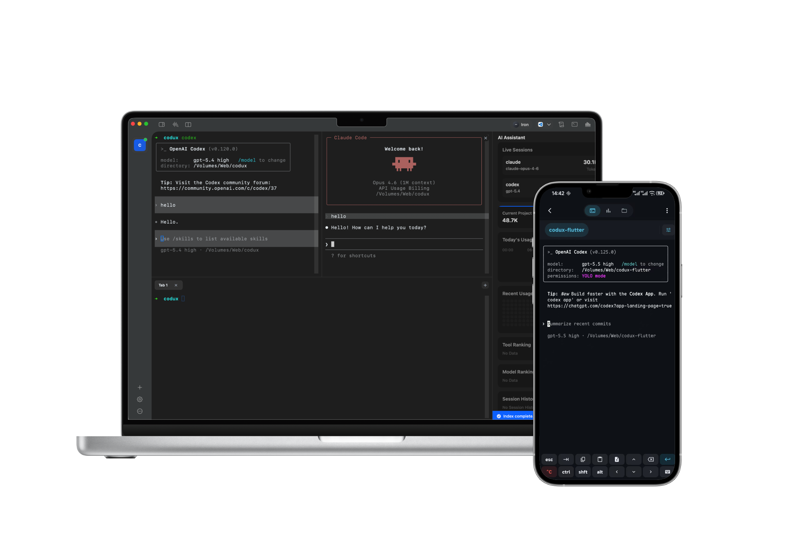

<p align="center">
  
</p>

<h1 align="center">dmux</h1>

<p align="center">
  The terminal workspace built for the AI coding era.
</p>

<p align="center">
  <a href="https://dmux.dux.cn">Website</a> &middot;
  <a href="https://github.com/dmuxapp/dmux/releases">Download</a> &middot;
  <a href="https://github.com/dmuxapp/dmux/issues">Feedback</a>
</p>

<p align="center">
  English | <a href="README.zh-CN.md">简体中文</a>
</p>

---



## Why dmux?

In the age of AI-assisted development, your IDE is no longer the center of your workflow — **the terminal is**.

Tools like Claude Code, GitHub Copilot CLI, Cursor, and Aider are turning the terminal into your primary development environment. But traditional terminals weren't designed for this:

- **Tab and split management is painful** — juggling multiple sessions across projects is slow and clunky
- **No project awareness** — no way to organize, switch, or get notifications per project
- **Git needs a separate app** — you're constantly switching between terminal, GitKraken, or Tower
- **AI usage is a black box** — you have no idea how many tokens you've burned today or which model is draining your quota
- **Electron-based alternatives are resource hogs** — they eat RAM and battery for what should be a lightweight tool

**dmux fixes all of this.** A native macOS terminal workspace purpose-built for AI CLI tools — multi-project, multi-pane, with built-in Git and real-time AI usage tracking. No Electron. No WebKit. Just pure SwiftUI + AppKit, fast and light.

## Features

### Multi-Project Workspace

Organize all your projects in one place. Each project gets its own terminal sessions, split layout, and state — everything is saved and restored automatically. Real-time activity monitoring watches your AI tools across all projects and notifies you when tasks complete, so you can context-switch without missing a beat.

### Flexible Split Panes

Split terminals horizontally, add bottom tabs, drag to resize. Work on multiple tasks within the same project without losing context.

### Built-in Git Panel

Branches, staged changes, file diffs, commit history, remote sync — all in a sidebar. No more switching to a separate Git GUI.

### AI Usage Dashboard

Track AI coding tools running in your terminal — token consumption, model usage, tool breakdowns, daily trends, and live session monitoring. Currently supports **Claude Code**, **Codex (OpenAI)**, and **Gemini CLI**, with more tools coming soon. Know exactly where your AI budget goes. Plus a fun daily tier system (Iron → Bronze → Silver → Gold → Platinum → Diamond → Master → Grandmaster) that ranks your AI usage intensity — how far can you climb today?

### Beautiful & Intuitive

Crafted with attention to every pixel. Glass vibrancy backgrounds, smooth animations, carefully balanced typography, and a clean visual hierarchy that stays out of your way. Light and dark mode are fully polished — not an afterthought. Customizable terminal themes, app icons, and keyboard shortcuts let you make it yours.

### Native & Lightweight

100% SwiftUI + AppKit. No Electron, no WebKit, no hidden browser eating your RAM. Launches instantly, idles at near-zero CPU, and respects your battery. This is what a macOS app should feel like.

## Getting Started

1. Download the latest release from [GitHub Releases](https://github.com/dmuxapp/dmux/releases) or [dmux.dux.cn](https://dmux.dux.cn)
2. Drag dmux to your Applications folder
3. Open dmux, click **New Project**, and pick a directory
4. Start typing — you're ready to go

> **"Cannot be opened because the developer cannot be verified"**
>
> Since dmux is not yet notarized by Apple, macOS may block the first launch. To fix this:
>
> ```bash
> sudo xattr -rd com.apple.quarantine /Applications/dmux.app
> ```
>
> Or go to **System Settings > Privacy & Security**, scroll down and click **Open Anyway** next to the dmux warning.

## Keyboard Shortcuts

| Action | Shortcut |
|:--|:--|
| New Split | `⌘T` |
| New Tab | `⌘D` |
| Toggle Git Panel | `⌘G` |
| Toggle AI Panel | `⌘Y` |
| Switch Project | `⌘1` - `⌘9` |

All shortcuts can be customized in **Settings > Shortcuts**.

## System Requirements

- macOS 14.0 (Sonoma) or later

## Feedback

Found a bug or have a feature request? Open an [issue on GitHub](https://github.com/dmuxapp/dmux/issues).

---

<p align="center">
  <a href="https://dmux.dux.cn">dmux.dux.cn</a>
</p>
