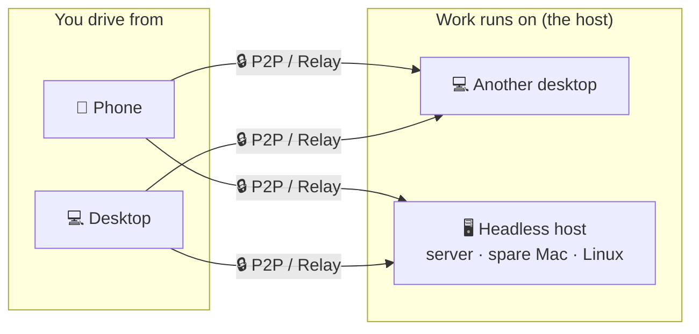

<p align="center">
  
</p>

<h1 align="center">Codux Terminal</h1>

<p align="center">
  <b>The high-performance, cross-device terminal built for AI coding</b><br/>
  Built with <b>Rust + GPUI</b>, Codux unifies Codex, Claude Code, and 6+ AI coding CLIs with live status, token analytics, local memory, secure SSH, and a desktop ⇄ phone ⇄ headless-host link for taking over long-running agent work from anywhere.
</p>

<p align="center">
  <a href="https://codux.dux.cn">Website</a> &middot;
  <a href="https://codux.dux.cn/zh-cn/getting-started/">Docs</a> &middot;
  <a href="https://github.com/duxweb/codux/releases/latest">Download</a> &middot;
  <a href="https://github.com/duxweb/codux-flutter/releases">Mobile</a> &middot;
  <a href="#contact--support">Contact</a> &middot;
  <a href="https://github.com/duxweb/codux/issues">Feedback</a>
</p>

<p align="center">
  English | <a href="README.zh-CN.md">简体中文</a>
</p>

---


## Why Codux AI

AI coding CLIs are incredibly powerful — and incredibly easy to lose control of. Real work sprawls across projects, Git worktrees, terminals, sessions, tokens, remote shells, and context you half-remember. **Codux AI turns that chaos into one durable, native workspace built for serious AI coding.**

| When AI coding gets messy | Codux AI gives you |
| :------------------------ | :----------------- |
| Every AI CLI has its own state | One project-aware view across Codex, Claude Code, OpenCode, Kiro CLI, Kimi Code, CodeWhale, MiMo Code, and Agy. |
| Long agent runs are hard to resume | Live status, local history, session restore, and context that follows each worktree. |
| Parallel tasks collide | A worktree-first model where every task keeps its own terminals, Git state, files, and AI sessions. |
| Token spend is a black box | Usage by tool, model, project, worktree, and day — no spreadsheets. |
| Context evaporates between sessions | Local memory for habits, project profiles, and module notes, injected back into supported CLIs automatically. |
| Server access is fragile | Saved, tested SSH profiles and a `codux-ssh` command agents can use **without ever seeing your credentials**. |
| You walk away mid-run | Pair your phone over P2P / relay links and keep driving the session from anywhere. |
| The code lives on another machine | Connect a headless host — a server, spare Mac, or Linux box — and drive its terminals, Git, and AI as if they were local. |

Codux AI is **not** another editor. It's the control plane for developers who live in AI coding CLIs and need a rock-solid way to run multi-project, long-running agent work.

## What You Can Do

Codux keeps AI coding work readable, recoverable, and connected across devices.

- Run Codex, Claude Code, and other AI coding CLIs in one workspace.
- Track live agent status, history, resume, and token usage without leaving the terminal workflow.
- Keep parallel tasks isolated by project and Git worktree so sessions, files, and Git state do not collide.
- Continue long-running work from your desktop, your phone, or a headless host running `codux`.
- Keep terminals, files, memory, and AI sessions on the machine that owns the work.

## AI CLI Support

Codux uses non-invasive wrappers and per-tool adapters. It does not write project prompt files or mutate your global AI CLI configuration just to inject Codux context.

| AI CLI | Live status | Token usage | Model setting | Full-access mode | Environment directives |
| :--- | :---: | :---: | :---: | :---: | :--- |
| Codex | ✓ | ✓ | ✓ | ✓ | ✓ via developer instructions |
| Claude Code / reclaude | ✓ | ✓ | ✓ | ✓ | ✓ via `--append-system-prompt` |
| OpenCode | ✓ | ✓ | ✓ | ✓ | ✓ via managed plugin config |
| MiMo Code | ✓ | ✓ | ✓ | ✓ | ✓ via managed plugin config |
| Kimi Code | ✓ | ✓ | ✓ | — | ✓ via managed `--agent-file` |
| Kiro CLI | ✓ | ✓ | ✓ | ✓ | Not injected; no confirmed non-invasive prompt channel |
| CodeWhale | ✓ | ✓ | ✓ | ✓ | Not injected for interactive sessions |
| Agy | ✓ | ✓ | ✓ | ✓ | Not injected; no confirmed non-invasive prompt channel |

Environment directives include Codux memory plus runtime commands such as `codux-ssh` and `codux-db`. For unsupported tools, Codux still tracks sessions where possible, but it will not force prompt injection through project files or user-level config.

## One Workspace, Every Device

> **Beta.** Connecting to a headless host ships first as a beta in this release — the connection, pairing, and host-side data flow are still under active testing, so expect rough edges. Feedback is very welcome.

Desktop, phone, and a headless host all act as **peers** over end-to-end encrypted **P2P / relay links**, so you can keep driving long agent runs from anywhere.

- **Direct when possible.** Codux prefers P2P paths and falls back to relay when the network requires it.
- **Not SSH remote desktop.** Pair devices once, then connect straight into Codux itself.
- **No public IP required.** Desktop, phone, and host can pair and reconnect across ordinary home, office, and mobile networks.



Any controller — a **desktop** or a **phone** — can connect to any host — **another desktop** or a **headless host**. A desktop is both: it hosts its own projects and can drive others; a phone drives only. The work stays on the host machine, so switching devices does not interrupt the session.

- **Phone handoff.** Pair in seconds and continue the same terminals, history, and AI sessions from your phone.
- **Headless host.** Run `codux` on a server, spare Mac, or Linux box and drive its terminals, Git, and AI as if they were local. See [`apps/agent/README.md`](apps/agent/README.md).
- **Session continuity.** Reconnect to the same running shells and agent sessions after disconnects.

## Download

**Desktop app**

macOS — install with [Homebrew](https://brew.sh):

```bash
brew install --cask duxweb/tap/codux
```

Or download directly:

| Platform | Download |
| :--- | :--- |
| macOS · Apple Silicon | [⬇ `codux-macos-aarch64.dmg`](https://github.com/duxweb/codux/releases/latest/download/codux-macos-aarch64.dmg) |
| macOS · Intel | [⬇ `codux-macos-x86_64.dmg`](https://github.com/duxweb/codux/releases/latest/download/codux-macos-x86_64.dmg) |
| Windows 11 · x64 | [⬇ `codux-windows-x86_64-setup.exe`](https://github.com/duxweb/codux/releases/latest/download/codux-windows-x86_64-setup.exe) |

Open the macOS `.dmg` and drag Codux to Applications; double-click the Windows installer. Then open a project, start your AI CLI, and go.

**Headless host (`codux-agent`)** — Beta, ships with 2.0

macOS / Linux — one line (auto-detects OS/arch, installs as `codux` on your `PATH`):

```bash
curl -fsSL https://raw.githubusercontent.com/duxweb/codux/main/apps/agent/scripts/install.sh | sh
```

Flags: `--beta` · `--version <x.y.z>` · `--dir <path>` · `--setup` · `--mirror <prefix>` (if GitHub is slow where you are) · `--uninstall`. Or download the binary directly:

| Platform | Download |
| :--- | :--- |
| macOS · Apple Silicon | [⬇ `codux-macos-aarch64`](https://github.com/duxweb/codux/releases/latest/download/codux-macos-aarch64) |
| macOS · Intel | [⬇ `codux-macos-x86_64`](https://github.com/duxweb/codux/releases/latest/download/codux-macos-x86_64) |
| Linux · arm64 | [⬇ `codux-linux-aarch64`](https://github.com/duxweb/codux/releases/latest/download/codux-linux-aarch64) |
| Linux · x64 | [⬇ `codux-linux-x86_64`](https://github.com/duxweb/codux/releases/latest/download/codux-linux-x86_64) |
| Windows · x64 | [⬇ `codux-windows-x86_64.exe`](https://github.com/duxweb/codux/releases/latest/download/codux-windows-x86_64.exe) |

Put the binary on your `PATH` as `codux`, then run `codux config` → `codux install` → `codux qrcode`.

## Headless host commands (`codux-agent`)

| Command | What it does |
| :--- | :--- |
| `codux config` | Interactive setup (device name, relay). Writes `codux.toml`. |
| `codux install` | Run as a startup service (launchd / `systemd --user` / Task Scheduler). |
| `codux start` / `stop` | Start (foreground) or stop the host. |
| `codux status` | Whether it's running, node id, and paired-device count. |
| `codux qrcode` / `link` | Show the pairing QR / print the pairing ticket to paste on the desktop. |
| `codux device` | List paired devices; `device:del <id>` / `device:rename <id>` / `device:clear` to manage. |
| `codux update` | Download, verify, and replace this binary, then restart the host. |
| `codux uninstall` | Stop and remove the service. |

Run `codux <command> --help` for details, or see [`apps/agent/README.md`](apps/agent/README.md).

## Web Tunnel Browser

When you control a paired headless host from Codux Desktop, the globe **Web
Tunnel Browser** button opens a proxy-isolated Chromium browser for web apps
running on that host.

- Host-local URLs are resolved on the host, not on your controller machine. If
  the host runs Vite at `http://127.0.0.1:5173/`, type that URL in the tunnel
  browser and it opens through the encrypted Codux link.
- The tunnel also covers HTTPS, WebSocket, HMR, LAN addresses, `.local` names,
  VPN routes, and host-bound development domains reachable from the host.
- Every `codux-agent` serves a built-in diagnostic page at
  `http://127.0.0.1:8765/`. Open it through the Web Tunnel Browser to verify the
  tunnel health and live round-trip latency.
- Testing on one computer still exercises the same tunnel path, but true
  cross-machine reachability should be verified with the Codux host running on a
  different machine.

## Keyboard Shortcuts

| Action | Shortcut |
| :----- | :------- |
| New Split | `⌘T` |
| New Tab | `⌘D` |
| Toggle Git Panel | `⌘G` |
| Toggle AI Panel | `⌘Y` |
| Switch Project | `⌘1` – `⌘9` |

Customize everything in **Settings → Shortcuts**.

## Demo Video

GitHub READMEs can't embed third-party players — watch the demo on [Bilibili](https://www.bilibili.com/video/BV1mK9vBCEYD/).

## System Requirements

**Desktop app**

- macOS 14.0 (Sonoma) or later
- Windows 11

**Headless host (`codux-agent`)**

- macOS, Linux, and Windows (x86_64 and arm64)

## Feedback

Found a bug or have a feature request? Open an [issue on GitHub](https://github.com/duxweb/codux/issues).

For bug reports, use **Help → Export Diagnostics** and attach the generated `.zip` — it bundles runtime logs, rotated logs, performance summaries, saved app state, invalid-state backups, and matching macOS diagnostic reports when available.

Manual log paths:

- `~/Library/Application Support/Codux/logs/runtime-rust.log`
- `~/Library/Application Support/Codux/logs/performance-summary.json`
- `%APPDATA%\Codux\logs\runtime-rust.log`

---

## Contributors

Thanks to everyone who has contributed code, issues, testing, and feedback to Codux.

<p align="center">
  <a href="https://github.com/duxweb/codux/graphs/contributors">
    
  </a>
</p>

## Contact & Support

Add the author on WeChat, or buy the author a coffee.

<p align="center">
  
  &nbsp;&nbsp;&nbsp;
  
  &nbsp;&nbsp;&nbsp;
  
</p>

## GitHub Star Trend

[](https://star-history.com/#duxweb/codux&Date)

<p align="center">
  Wanted to be dmux, but that name was taken. So it's Codux now — which sounds like "Cool Dux" in Chinese.
</p>

<p align="center">
  <a href="https://codux.dux.cn">codux.dux.cn</a>
</p>
