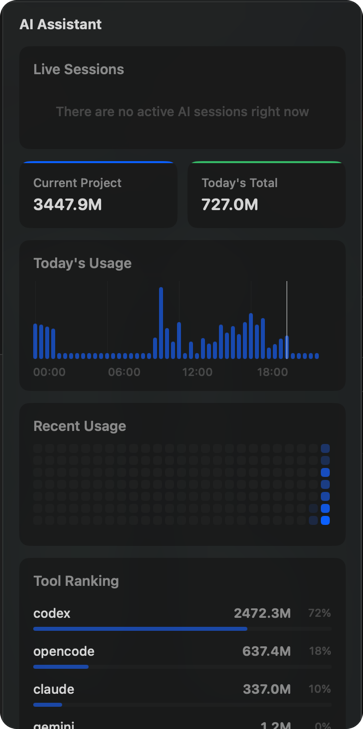
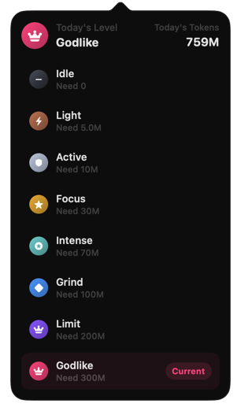
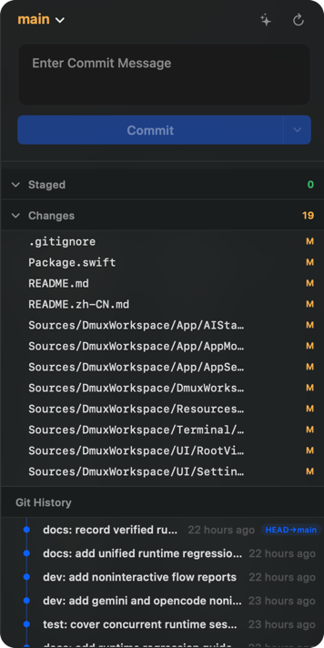

<p align="center">
  
</p>

<h1 align="center">Codux</h1>

<p align="center">
  A cross-platform AI development workstation with projects, terminals, Git, AI stats, memory, mobile control, and desktop companions.<br/>
  Built for <b>Claude Code</b>, <b>Codex</b>, <b>Gemini CLI</b>, <b>OpenCode</b>, and <b>Kiro CLI</b>.
</p>

<p align="center">
  <a href="https://codux.dux.cn">Website</a> &middot;
  <a href="https://github.com/duxweb/codux/releases">Download</a> &middot;
  <a href="https://github.com/duxweb/codux-flutter/releases">Mobile</a> &middot;
  <a href="https://github.com/duxweb/codux-service/releases">Relay Service</a> &middot;
  <a href="https://github.com/duxweb/codux/issues">Feedback</a>
</p>

<p align="center">
  English | <a href="README.zh-CN.md">简体中文</a>
</p>

<p align="center">
  The cross-platform desktop app now lives on <code>main</code>. The original macOS app is preserved on the <code>swift-macos</code> branch.
</p>

---


<table align="center">
<tr>
  <td align="center"><br/><sub>AI Stats &amp; Session Restore</sub></td>
  <td align="center"><br/><sub>Daily Level</sub></td>
</tr>
<tr>
  <td align="center"><br/><sub>Built-in Git</sub></td>
  <td align="center"><br/><sub>Pet Companion</sub></td>
</tr>
</table>

## Demo Video

GitHub README does not render third-party iframe players. Watch the demo on [Bilibili](https://www.bilibili.com/video/BV1mK9vBCEYD/).

## 10 Highlights

| #   | Feature                        | What it does                                                                                                                                                                                                                                                                                                             |
| :-- | :----------------------------- | :----------------------------------------------------------------------------------------------------------------------------------------------------------------------------------------------------------------------------------------------------------------------------------------------------------------------- |
| 1   | **Live AI Activity**           | Real-time status + system notifications for every running AI terminal (Claude Code, Codex, Gemini CLI, OpenCode, Kiro CLI). The tab indicator, project tile, and desktop notification all light up the moment a turn finishes — no more watching the cursor blink.                                                          |
| 2   | **AI Stats & Session Restore** | Token totals split by tool / model / project, daily and trend views, and **one-click resume** of any past session back into the original tool. Scattered AI runs turn into a usable history.                                                                                                                             |
| 3   | **Daily Level**                | A daily ladder powered by real token usage. One snapshot tells you what you ran, how much, and how today compares to a normal day — easy to glance at, hard to fudge.                                                                                                                                                    |
| 4   | **Pet Companion**              | An optional pet in the title bar that grows with your AI coding habits. It supports Codex-format custom pet imports, so compatible `pet.json` + `spritesheet.png` packages can be installed from Petdex, renamed, validated, adopted, archived, and restored alongside the bundled pets. Fully optional, one-click mute. |
| 5   | **Built-in Git**               | A first-class Git panel — not an embedded webview. Branch checkout / create / rename / delete, staging with line-level diffs, full commit history, and push / pull / sync with sane defaults and clear conflict resolution.                                                                                              |
| 6   | **Project File Browser**       | Per-project native file manager. Edit code inline, preview images and other assets, and drag any file straight into the terminal so your AI tool gets the right path on the first try.                                                                                                                                   |
| 7   | **Multi-Project Workspaces**   | Every project is its own room — up to **6 split terminals** for parallel work plus **unlimited tabs** when 6 is not enough. Each project keeps its own layout, sessions, AI tool selection, and state across restarts.                                                                                                   |
| 8   | **Three-Layer AI Memory**      | Local `memory.sqlite3` extracts long-term memory from completed sessions, layered as **user / project / tool**. App-private `CLAUDE.md`, `AGENTS.md`, `GEMINI.md` are generated so supported AI CLIs no longer forget what you did last session — and nothing is written into your repo.                                |
| 9   | **Mobile Handoff**             | Step away from the desktop and keep going on your phone. Codux Mobile pairs with the desktop host to drive AI CLI sessions remotely with end-to-end encrypted relay traffic. See the [Mobile Handoff](#mobile-handoff) section below.                                                                                    |
| 10  | **Terminal Engine & Themes**   | A WebView terminal with GPU-accelerated rendering, split panes, tabs, and curated light / dark themes that follow the selected app appearance.                                                                                                                                                                           |

## AI Tool Support

Codux detects supported AI CLIs from the terminal, installs app-managed hook files where the tool exposes a hook system, and supplements live events by reading each tool's local session history.

| Tool | Command aliases | Live activity | History / token stats | Resume / restore | Memory injection |
| :--- | :-------------- | :------------ | :-------------------- | :--------------- | :--------------- |
| Claude Code | `claude`, `claude-code` | Full | Full | Full | Supported |
| Codex | `codex` | Full | Full | Full | Supported |
| Gemini CLI | `gemini` | Full | Full | Full | Supported |
| OpenCode | `opencode` | Full | Full | Full | Supported |
| Kiro CLI | `kiro`, `kiro-cli` | Full | Full | Partial | Supported |

`Full` means Codux can drive the feature from the normal integrated terminal workflow. `Partial` means the tool has enough local data for status / history, but the restore behavior still depends on the tool's own CLI support. `Supported` means Codux can inject app-managed memory for that tool.

## Custom Pets

Codux can import custom companions built with the same flat Codex pet package format: one `pet.json` manifest plus one `spritesheet.png` atlas. Open the Petdex marketplace from the pet claim or Petdex flow, paste a Petdex pet page URL, preview the metadata, adjust the display name, and install it into Codux. Installed custom pets appear with the bundled companions and keep the same adoption, archive, restore, animation, bubble, and growth behavior.

Creators can use the [Codex pet atlas guide](docs/pet-codex-atlas.md) to generate compatible `8 x 9` atlases and package them for import.

## Mobile Handoff

Codux Mobile + Codux Service are a separate stack so the relay can be self-hosted while the desktop app stays the real terminal host.

| Component     | Purpose                                                                                                | Download                                                             |
| :------------ | :----------------------------------------------------------------------------------------------------- | :------------------------------------------------------------------- |
| Codux Desktop | Main desktop app: projects, terminals, Git, stats, memory, remote host.                                | [Desktop Releases](https://github.com/duxweb/codux/releases)         |
| Codux Mobile  | Android client: pair with the desktop host, run AI CLI sessions remotely, browse files, upload images. | [Mobile Releases](https://github.com/duxweb/codux-flutter/releases)  |
| Codux Service | Lightweight Go relay for device pairing and encrypted WebSocket forwarding.                            | [Service Releases](https://github.com/duxweb/codux-service/releases) |

For a quick trial, enter one of the official trial relays in **Settings > Remote**:

| Node                        | URL                              |
| :-------------------------- | :------------------------------- |
| China relay direct          | `https://codux-service.dux.plus` |
| Global transit acceleration | `https://codux-node.dux.plus`    |

Terminal input, output, file payloads, project lists, and AI stats are end-to-end encrypted between Codux Desktop and Codux Mobile. The relay sees only routing metadata (host ID, device ID, pairing state, online state) — never decrypted terminal content. For long-term use, self-hosting `codux-service` is recommended.

## Getting Started

### Install from Release

1. Download the latest macOS or Windows build from [GitHub Releases](https://github.com/duxweb/codux/releases) or [codux.dux.cn](https://codux.dux.cn)
2. Install Codux:
   - macOS: open the `.dmg` and drag Codux to Applications
   - Windows: run the `.msi` installer
3. Open Codux, click **New Project** or **Open Folder**, and pick a directory
4. Start typing — you're ready to go

Codux uses the built-in updater. Stable releases and beta releases are published from GitHub Releases, and the app checks the configured channel automatically.

### Which File Should I Download?

| Platform | File | Use case |
| :------- | :--- | :------- |
| macOS | `macos-universal-formal.dmg` | Recommended macOS installer. Developer ID signed and notarized. |
| macOS | `macos-universal-unsigned.dmg` | Fast fallback / test build. macOS Gatekeeper may require **Open Anyway** on first launch. |
| macOS | `macos-universal-*-updater.app.tar.gz` | Automatic updater package. Do not install manually. |
| Windows | `windows-x86_64-msi-*.msi` | Recommended Windows installer. |
| Windows | `windows-x86_64-nsis-*.exe` | Alternative Windows installer. |
| All | `latest.json` | Updater metadata. Do not download manually. |

Windows builds are currently validated and supported on Windows 11 only. Windows 10 compatibility has not been tested and is not a current support target.

If macOS blocks an unsigned build, go to **System Settings > Privacy & Security** and click **Open Anyway** next to the Codux warning, or run:

```bash
sudo xattr -rd com.apple.quarantine /Applications/Codux.app
```

### Development

```bash
pnpm install
pnpm tauri dev
```

Useful checks before submitting changes:

```bash
pnpm exec tsc --noEmit
pnpm run lint
cargo check --manifest-path src-tauri/Cargo.toml
```

### Release

Desktop releases are created by pushing a desktop release tag:

```bash
git tag v1.0.0-beta.1
git push origin v1.0.0-beta.1
```

The release workflow reads the tag, writes the app version into the desktop/package manifests, extracts the matching `CHANGELOG.md` section, builds macOS and Windows artifacts, publishes a GitHub Release, and updates the beta or stable updater channel.

## Keyboard Shortcuts

| Action           | Shortcut    |
| :--------------- | :---------- |
| New Split        | `⌘T`        |
| New Tab          | `⌘D`        |
| Toggle Git Panel | `⌘G`        |
| Toggle AI Panel  | `⌘Y`        |
| Switch Project   | `⌘1` - `⌘9` |

All shortcuts can be customized in **Settings > Shortcuts**.

## System Requirements

- macOS 14.0 (Sonoma) or later
- Windows 11 with Microsoft WebView2 Runtime

## Feedback

Found a bug or have a feature request? Open an [issue on GitHub](https://github.com/duxweb/codux/issues).

When reporting a bug, the easiest path is `Help -> Export Diagnostics…` — save the generated `.zip` and attach it to your GitHub issue. The archive bundles runtime logs, rotated logs, performance summaries, saved app state, invalid state backups, and any matching macOS crash / hang / spin reports.

If you need to collect logs manually, Codux writes runtime logs to:

- `~/Library/Application Support/Codux/logs/runtime.log`
- `~/Library/Application Support/Codux/logs/runtime.previous.log`
- `~/Library/Application Support/Codux/logs/performance-summary.json`
- `%APPDATA%\Codux\logs\runtime.log`

Notes:

- Codux clears the previous app session logs on each launch
- `runtime.previous.log` only appears once the current session log rotates
- `performance-summary.json` covers recent performance spikes / main-thread stalls

Open the macOS log folder directly:

```bash
open ~/Library/Application\ Support/Codux/logs
```

If the app crashes or hangs right after launch, macOS may write a system crash report to `~/Library/Logs/DiagnosticReports/` (look for `Codux-*.ips` or `dmux-*.ips`). Attach the file whose timestamp is closest to the crash.

```bash
open ~/Library/Logs/DiagnosticReports
```

When opening an issue, please include: OS version + Codux version, repro steps, `runtime.log`, `runtime.previous.log` (if present), `performance-summary.json` (if present), and the matching crash report (if any).

---

## GitHub Star Trend

[](https://star-history.com/#duxweb/codux&Date)

<p align="center">
  Wanted to be dmux, but that name was taken. So it's Codux now, which sounds like "Cool Dux" in Chinese.
</p>

<p align="center">
  <a href="https://codux.dux.cn">codux.dux.cn</a>
</p>
