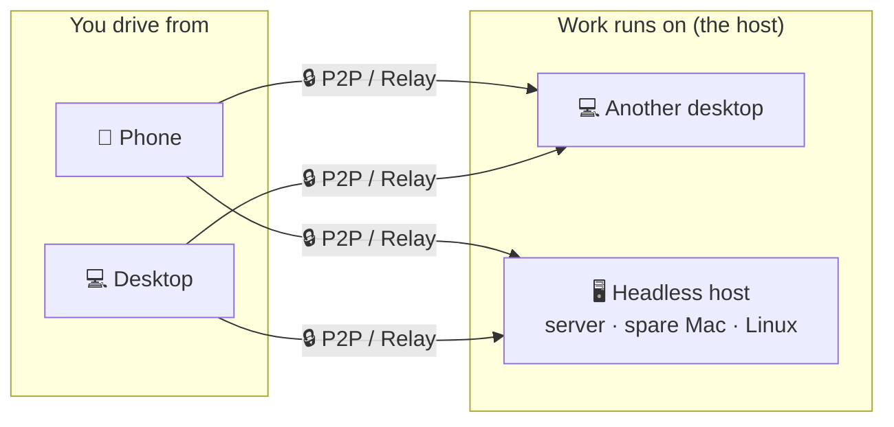

<p align="center">
  
</p>

<h1 align="center">Codux</h1>

<p align="center">
  <b>The high-performance AI coding terminal — desktop, phone, and server, one workspace</b><br/>
  Built with <b>Rust + GPUI</b>, Codux unifies Codex, Claude Code, and 8+ AI coding CLIs with live agent status, token analytics, local memory, credential-isolated SSH &amp; database access, and encrypted device links for taking over long-running agent work from anywhere.
</p>

<p align="center">
  <a href="https://github.com/duxweb/codux/releases/latest"></a>
  <a href="https://github.com/duxweb/codux/releases"></a>
  
  <a href="LICENSE"></a>
  <a href="https://github.com/duxweb/codux/stargazers"></a>
</p>

<p align="center">
  <a href="https://codux.work">Website</a> &middot;
  <a href="https://codux.work/getting-started/">Docs</a> &middot;
  <a href="https://github.com/duxweb/codux/releases/latest">Download</a> &middot;
  <a href="https://github.com/duxweb/codux-flutter/releases/latest">Mobile</a> &middot;
  <a href="https://github.com/duxweb/codux/issues">Feedback</a>
</p>

<p align="center">
  English | <a href="README.zh-CN.md">简体中文</a> | <a href="README.ja.md">日本語</a> | <a href="README.ko.md">한국어</a>
</p>

---


https://github.com/user-attachments/assets/cabf21a9-8649-4e65-9e8a-db27ccaccdf3

<p align="center">
  <a href="https://github.com/user-attachments/assets/cabf21a9-8649-4e65-9e8a-db27ccaccdf3">▶ Watch the demo</a>
</p>

## Why Codux

AI coding CLIs are incredibly powerful — and incredibly easy to lose control of. Real work sprawls across projects, Git worktrees, terminals, sessions, tokens, remote shells, and context you half-remember. **Codux turns that chaos into one durable, native workspace built for serious AI coding.**

| When AI coding gets messy | Codux gives you |
| :------------------------ | :-------------- |
| Every AI CLI has its own state | One project-aware view across Codex, Claude Code, OpenCode, Kiro CLI, Kimi Code, CodeWhale, MiMo Code, and Agy. |
| Long agent runs are hard to resume | Live status, local history, session restore, and context that follows each worktree. |
| Parallel tasks collide | A worktree-first model where every task keeps its own terminals, Git state, files, and AI sessions. |
| Token spend is a black box | Usage by tool, model, project, worktree, and day — no spreadsheets. |
| Context evaporates between sessions | Local memory for habits, project profiles, and module notes, injected back into supported CLIs automatically. |
| Credentials end up in prompts | Saved, tested SSH and database profiles, plus `codux-ssh` / `codux-db` commands agents can use **without ever seeing your credentials**. |
| You walk away mid-run | Pair your phone over P2P / relay links and keep driving the session from anywhere. |
| The code lives on another machine | Connect a headless host — a server, spare Mac, or Linux box — and drive its terminals, Git, and AI as if they were local. |
| Your Windows project lives in WSL | Use an installed WSL distribution as a native Codux runtime, keeping files, Git, worktrees, terminals, and AI sessions inside Linux. |

Codux is **not** another editor. It's the control plane for developers who live in AI coding CLIs and need a rock-solid way to run multi-project, long-running agent work.

## Quick Start

macOS — install with [Homebrew](https://brew.sh):

```bash
brew install --cask duxweb/tap/codux
```

1. **Open a project.** Git worktrees, project state, and per-project sessions are picked up automatically.
2. **Start your AI CLI in the built-in terminal** — `codex`, `claude`, `opencode`, and friends. The non-invasive wrapper lights up live status, token tracking, and memory injection with zero configuration.
3. **Leave the desk.** Pair your phone or a headless host once, then take over the same running session from anywhere.

On Windows, or without Homebrew: see [Download](#download).

## Your Credentials Never Reach the AI

Agents constantly need servers and databases — but pasting a password into a prompt, or letting the model read your config files, is exactly how credentials leak. Codux stores connection profiles locally and hands agents two safe commands instead:

- **`codux-ssh`** — the agent runs `codux-ssh list`, sees profile names and hosts only, and connects through the wrapper. Passwords and keys are injected inside Codux's helper process; they never enter the model's context, the transcript, or your shell history.
- **`codux-db`** — the same isolation for MySQL / PostgreSQL / SQLite: saved once in Codux, queried by profile name. Read-only profiles are enforced inside the wrapper with a single-statement allowlist, so the model can't escalate its own access.
- **Zero per-project setup.** Every supported CLI learns about these commands automatically through Codux's environment directives.

<p align="center"></p>

## AI CLI Support

Codux uses non-invasive wrappers and per-tool adapters. It does not write project prompt files or mutate your global AI CLI configuration just to inject Codux context.

| AI CLI | Live status | Token usage | Model setting | Full-access mode | Environment directives |
| :--- | :---: | :---: | :---: | :---: | :--- |
| Codex | ✓ | ✓ | ✓ | ✓ | ✓ via developer instructions |
| Claude Code / reclaude | ✓ | ✓ | ✓ | ✓ | ✓ via `--append-system-prompt` |
| OpenCode | ✓ | ✓ | ✓ | ✓ | ✓ via managed plugin config |
| MiMo Code | ✓ | ✓ | ✓ | ✓ | ✓ via managed plugin config |
| Kimi Code | ✓ | ✓ | ✓ | — | ✓ via managed `--agent-file` |
| Kiro CLI | ✓ | ✓ | ✓ | ✓ | Not injected; no confirmed non-invasive prompt channel |
| CodeWhale | ✓ | ✓ | ✓ | ✓ | Not injected for interactive sessions |
| Agy | ✓ | ✓ | ✓ | ✓ | Not injected; no confirmed non-invasive prompt channel |

Environment directives include Codux memory plus runtime commands such as `codux-ssh` and `codux-db`. For unsupported tools, Codux still tracks sessions where possible, but it will not force prompt injection through project files or user-level config.

## One Workspace, Every Device

> **Beta.** Connecting to a headless host ships first as a beta in this release — the connection, pairing, and host-side data flow are still under active testing, so expect rough edges. Feedback is very welcome.

Powered by [iroh](https://iroh.computer), desktop, phone, and a headless host all act as **peers** over end-to-end encrypted **P2P / relay links**, so you can keep driving long agent runs from anywhere.

- **Direct when possible.** Codux prefers P2P paths and falls back to relay when the network requires it.
- **Not SSH remote desktop.** Pair devices once, then connect straight into Codux itself.
- **No public IP required.** Desktop, phone, and host can pair and reconnect across ordinary home, office, and mobile networks.



Any controller — a **desktop** or a **phone** — can connect to any host — **another desktop** or a **headless host**. A desktop is both: it hosts its own projects and can drive others; a phone drives only. The work stays on the host machine, so switching devices does not interrupt the session.

- **Phone handoff.** Pair in seconds and continue the same terminals, history, and AI sessions from your phone.
- **Headless host.** Run `codux` on a server, spare Mac, or Linux box and drive its terminals, Git, and AI as if they were local. See [`apps/agent/README.md`](apps/agent/README.md).
- **Session continuity.** Reconnect to the same running shells and agent sessions after disconnects.

## Your Terminal Pet

Every token your agents burn feeds a pixel pet that lives in your workspace. Hatch it, name it, and watch it level up as you code — its five stats (Wisdom, Chaos, Night, Stamina, Empathy) grow out of how, and when, you actually work. Install custom sprite pets, or retire old companions into your hall of fame.

Completely useless. Absolutely essential.

<p align="center"></p>

## Local-First by Design

- **Your data stays yours.** Projects, terminals, sessions, memory, token stats, and credentials live on your machines — there is no Codux cloud and no account to sign up for.
- **Encrypted device links.** Desktop ⇄ phone ⇄ host traffic is end-to-end encrypted; relays only forward ciphertext when a direct P2P path isn't possible.
- **Non-invasive by principle.** Codux never writes prompt files into your repositories and never mutates your AI CLIs' global configs — all context injection goes through wrappers and per-tool adapters you can inspect.

## Download

**Desktop app**

macOS — install with [Homebrew](https://brew.sh):

```bash
brew install --cask duxweb/tap/codux
```

Or download directly:

| Platform | Download |
| :--- | :--- |
| macOS · Apple Silicon | [⬇ `codux-macos-aarch64.dmg`](https://github.com/duxweb/codux/releases/latest/download/codux-macos-aarch64.dmg) |
| macOS · Intel | [⬇ `codux-macos-x86_64.dmg`](https://github.com/duxweb/codux/releases/latest/download/codux-macos-x86_64.dmg) |
| Windows 11 · x64 | [⬇ `codux-windows-x86_64-setup.exe`](https://github.com/duxweb/codux/releases/latest/download/codux-windows-x86_64-setup.exe) |

Open the macOS `.dmg` and drag Codux to Applications; double-click the Windows installer. Then open a project, start your AI CLI, and go.

**Windows + WSL.** Open **Settings → WSL** to enable the integration, install or select a distribution, and install or update Codux Runtime with one click. When adding a project, choose a directory inside that WSL distribution; Codux then routes its files, Git, worktrees, terminals, and AI sessions through WSL automatically.

**Mobile app**

Download the Android APK from the [latest Codux Mobile release](https://github.com/duxweb/codux-flutter/releases/latest), or get the iOS app on the [App Store](https://apps.apple.com/cn/app/codux/id6772156906).

> **Why is the iOS app paid?** Codux is fully open source (GPL-3.0); desktop and Android are free. The iOS price only covers Apple’s $99/year developer fee and revenue cut, and supports ongoing development — no subscriptions, no in-app purchases. Prefer not to pay? Build the identical app yourself from this repo's [`apps/mobile`](apps/mobile) source.

**Headless host (`codux-agent`)** — Beta, ships with 2.0

macOS / Linux — one line (auto-detects OS/arch, installs as `codux` on your `PATH`):

```bash
curl -fsSL https://raw.githubusercontent.com/duxweb/codux/main/apps/agent/scripts/install.sh | sh
```

Flags: `--beta` · `--version <x.y.z>` · `--dir <path>` · `--setup` · `--mirror <prefix>` (if GitHub is slow where you are) · `--uninstall`. Or download the binary directly:

| Platform | Download |
| :--- | :--- |
| macOS · Apple Silicon | [⬇ `codux-macos-aarch64`](https://github.com/duxweb/codux/releases/latest/download/codux-macos-aarch64) |
| macOS · Intel | [⬇ `codux-macos-x86_64`](https://github.com/duxweb/codux/releases/latest/download/codux-macos-x86_64) |
| Linux · arm64 | [⬇ `codux-linux-aarch64`](https://github.com/duxweb/codux/releases/latest/download/codux-linux-aarch64) |
| Linux · x64 | [⬇ `codux-linux-x86_64`](https://github.com/duxweb/codux/releases/latest/download/codux-linux-x86_64) |
| Windows · x64 | [⬇ `codux-windows-x86_64.exe`](https://github.com/duxweb/codux/releases/latest/download/codux-windows-x86_64.exe) |

Put the binary on your `PATH` as `codux`, then run `codux config` → `codux install` → `codux qrcode`.

Run `codux <command> --help` for details, or see [`apps/agent/README.md`](apps/agent/README.md).

<details>
<summary><b>All headless host commands</b></summary>

| Command | What it does |
| :--- | :--- |
| `codux config` | Interactive setup (device name, relay). Writes `codux.toml`. |
| `codux install` | Run as a startup service (launchd / `systemd --user` / Task Scheduler). |
| `codux start` / `stop` | Start (foreground) or stop the host. |
| `codux status` | Whether it's running, node id, and paired-device count. |
| `codux qrcode` / `link` | Show the pairing QR / print the pairing ticket to paste on the desktop. |
| `codux device` | List paired devices; `device:del <id>` / `device:rename <id>` / `device:clear` to manage. |
| `codux update` | Download, verify, and replace this binary, then restart the host. |
| `codux uninstall` | Stop and remove the service. |

</details>

## Web Tunnel Browser

When you control a paired headless host from Codux Desktop, the globe **Web Tunnel Browser** button opens a proxy-isolated Chromium that browses **as the host**: if the host runs Vite at `http://127.0.0.1:5173/`, type that URL and it opens through the encrypted Codux link — HTTPS, WebSocket, HMR, LAN addresses, `.local` names, and VPN routes included.

<details>
<summary><b>Diagnostics &amp; notes</b></summary>

- Host-local URLs are resolved on the host, not on your controller machine.
- Every `codux-agent` serves a built-in diagnostic page at `http://127.0.0.1:8765/`. Open it through the Web Tunnel Browser to verify tunnel health and live round-trip latency.
- Testing on one computer still exercises the same tunnel path, but true cross-machine reachability should be verified with the Codux host running on a different machine.

</details>

## Keyboard Shortcuts

| Action | Shortcut |
| :----- | :------- |
| New Split | `⌘T` |
| Toggle Git Panel | `⌘G` |
| Toggle AI Panel | `⌘Y` |
| Switch Project | `⌘1` – `⌘9` |

Customize everything in **Settings → Shortcuts**.

## System Requirements

**Desktop app**

- macOS 14.0 (Sonoma) or later
- Windows 11

**Headless host (`codux-agent`)**

- macOS, Linux, and Windows (x86_64 and arm64)

## Feedback

Found a bug or have a feature request? Open an [issue on GitHub](https://github.com/duxweb/codux/issues).

For bug reports, use **Help → Export Diagnostics** and attach the generated `.zip` — it bundles runtime logs, rotated logs, performance summaries, saved app state, invalid-state backups, and matching macOS diagnostic reports when available.

Manual log paths:

- `~/Library/Application Support/Codux/logs/runtime-rust.log`
- `~/Library/Application Support/Codux/logs/performance-summary.json`
- `%APPDATA%\Codux\logs\runtime-rust.log`

---

## Community Support

Codux recognizes and supports the [LINUX DO](https://linux.do) community.

## Contributors

Thanks to everyone who has contributed code, issues, testing, and feedback to Codux.

<p align="center">
  <a href="https://github.com/duxweb/codux/graphs/contributors">
    
  </a>
</p>

## GitHub Star Trend

If Codux ever rescued one of your long agent runs, a ⭐ helps more people find it.

<a href="https://www.star-history.com/?repos=duxweb%2Fcodux&type=date&legend=top-left">
 <picture>
   <source media="(prefers-color-scheme: dark)" srcset="https://api.star-history.com/chart?repos=duxweb/codux&type=date&theme=dark&legend=top-left&sealed_token=hYXmcj_MIXkk4COkJV3llI2Vncn3-XEuwNNDVBZSDAnWmo3FHKZPS3sdLNsV5xv2SankP2QgPa7CX8vr6TvHzGolQTRk7sTLnTIM3sFHCIvUFOR_QPLWsA" />
   <source media="(prefers-color-scheme: light)" srcset="https://api.star-history.com/chart?repos=duxweb/codux&type=date&legend=top-left&sealed_token=hYXmcj_MIXkk4COkJV3llI2Vncn3-XEuwNNDVBZSDAnWmo3FHKZPS3sdLNsV5xv2SankP2QgPa7CX8vr6TvHzGolQTRk7sTLnTIM3sFHCIvUFOR_QPLWsA" />
   
 </picture>
</a>

<p align="center">
  Wanted to be dmux, but that name was taken. So it's Codux now — which sounds like "Cool Dux" in Chinese.
</p>

<p align="center">
  <a href="https://codux.work">codux.work</a>
</p>
