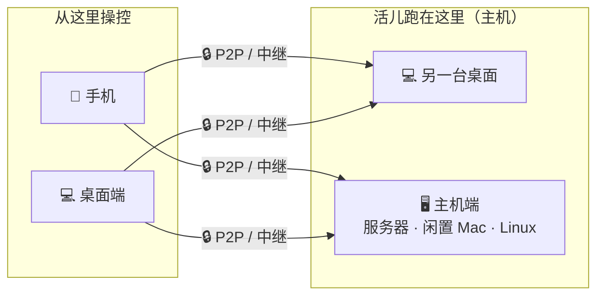

<p align="center">
  
</p>

<h1 align="center">Codux Terminal</h1>

<p align="center">
  <b>为 AI 编程而生的高性能跨端互联终端</b><br/>
  用 <b>Rust + GPUI</b> 原生打造，统一 Codex、Claude Code 等 8+ AI 编程 CLI，整合实时状态、Token 统计、本地记忆与安全 SSH，并连接桌面、手机和主机端，让你随时随地接管长时间运行的 agent 任务。
</p>

<p align="center">
  <a href="https://codux.dux.cn">官网</a> &middot;
  <a href="https://codux.dux.cn/zh-cn/getting-started/">文档</a> &middot;
  <a href="https://github.com/duxweb/codux/releases/latest">下载</a> &middot;
  <a href="https://github.com/duxweb/codux-flutter/releases">移动端</a> &middot;
  <a href="#作者微信">作者微信</a> &middot;
  <a href="https://github.com/duxweb/codux/issues">反馈</a>
</p>

<p align="center">
  <a href="README.md">English</a> | 简体中文
</p>

---


## 为什么用 Codux AI

AI 编程 CLI 很强——也极其容易失控。真正干活时，工作会散落到项目、Git worktree、终端、历史会话、Token、远程 shell，和你只记得一半的上下文里。**Codux AI 把这片混乱收进一个稳定的原生工作台，专为认真做 AI 编程的人打造。**

| AI 编程哪里容易乱 | Codux AI 给你什么 |
| :---------------- | :---------------- |
| 每个 AI CLI 各管各的状态 | 一个按项目组织的视图，统一 Codex、Claude Code、OpenCode、Kiro CLI、Kimi Code、CodeWhale、MiMo Code、Agy。 |
| 长 agent 任务难恢复 | 实时运行状态、本地历史、会话恢复，还有跟着 worktree 走的上下文。 |
| 并行任务互相打架 | 以 worktree 为核心：每个任务保留自己的终端、Git 状态、文件和 AI 会话。 |
| Token 花销是个黑盒 | 按工具、模型、项目、worktree、日期统计用量——不用再记账。 |
| 会话之间上下文蒸发 | 本地记忆保存习惯、项目画像、模块笔记，并自动注入回支持的 CLI。 |
| 服务器连接又脆又危险 | 已保存、已测试的 SSH 配置，加一个 **凭证永不外泄** 的 `codux-ssh` 命令给 agent 用。 |
| 任务跑一半离开电脑 | 用手机通过 P2P / 中继链路配对，随时随地接着控制会话。 |
| 代码在另一台机器上 | 连上一台 Codux 主机——服务器、闲置的 Mac 或 Linux——像操作本地一样驱动它的终端、Git 和 AI。 |

Codux AI **不是** 又一个编辑器。它是给重度泡在 AI 编程 CLI 里的开发者的控制台，让多项目、长会话的 agent 工作稳得住。

## 你可以用 Codux 做什么

Codux 让 AI 编程工作在多设备之间依然清晰、可恢复、可持续接管。

- 在一个工作区里运行 Codex、Claude Code 和其他 AI 编程 CLI。
- 直接看到 agent 的实时状态、历史、恢复与 Token 用量，不用离开终端工作流。
- 按项目和 Git worktree 隔离并行任务，不让会话、文件和 Git 状态互相串扰。
- 从桌面、手机或运行 `codux` 的主机端继续接管长时间运行的工作。
- 让终端、文件、记忆和 AI 会话始终留在真正干活的那台机器上。

## AI CLI 支持

Codux 使用非侵入式 wrapper 和各工具适配器。为了注入 Codux 上下文，它不会写入项目提示词文件，也不会修改你的全局 AI CLI 配置。

| AI CLI | 实时状态 | Token 用量 | 模型设置 | 完全权限模式 | 环境指令注入 |
| :--- | :---: | :---: | :---: | :---: | :--- |
| Codex | ✓ | ✓ | ✓ | ✓ | ✓，通过 developer instructions |
| Claude Code / reclaude | ✓ | ✓ | ✓ | ✓ | ✓，通过 `--append-system-prompt` |
| OpenCode | ✓ | ✓ | ✓ | ✓ | ✓，通过 Codux 托管的 plugin 配置 |
| MiMo Code | ✓ | ✓ | ✓ | ✓ | ✓，通过 Codux 托管的 plugin 配置 |
| Kimi Code | ✓ | ✓ | ✓ | — | ✓，通过 Codux 托管的 `--agent-file` |
| Kiro CLI | ✓ | ✓ | ✓ | ✓ | 不注入；暂无已确认的非侵入提示词通道 |
| CodeWhale | ✓ | ✓ | ✓ | ✓ | 不注入交互式会话 |
| Agy | ✓ | ✓ | ✓ | ✓ | 不注入；暂无已确认的非侵入提示词通道 |

环境指令包含 Codux 记忆，以及 `codux-ssh`、`codux-db` 等运行时命令说明。对暂不支持注入的工具，Codux 仍会尽可能追踪会话状态，但不会为了提示词注入去强写项目文件或用户级配置。

## 一套工作区，多端互联

> **Beta。** 连接主机端会先在本次版本里以 beta 形式上线——连接、配对、主机侧数据链路都还在持续测试中，可能会有粗糙的地方，欢迎反馈。

桌面端、手机、主机端互为 **peer**，经端到端加密的 **P2P / 中继链路** 连通，让你随时随地接着跑长 agent 任务。

- **能直连就直连。** Codux 优先走 P2P，网络环境不允许时自动回落到中继。
- **不是 SSH 远程桌面。** 设备配对一次，之后就是直接连到 Codux 自己。
- **不需要公网 IP。** 桌面、手机和主机端都可以在家庭、公司和移动网络下完成配对与重连。



任意操控端——**桌面**或**手机**——都能连接任意主机——**另一台桌面**或**主机端**。桌面端既能托管自己的项目，也能去操控别人；手机只负责操控。真正的工作始终留在主机上，所以换设备不会打断会话。

- **手机接力。** 几秒完成配对，在手机上继续同一批终端、历史和 AI 会话。
- **主机端。** 把 `codux` 跑在服务器、闲置 Mac 或 Linux 上，像本地一样驱动它的终端、Git 和 AI。详见 [`apps/agent/README.md`](apps/agent/README.md)。
- **会话不断。** 断线重连后，恢复的是同一批正在运行的 shell 和 agent 会话。

## 下载

**桌面端**

macOS —— 用 [Homebrew](https://brew.sh) 安装：

```bash
brew install --cask duxweb/tap/codux
```

或直接下载：

| 平台 | 下载 |
| :--- | :--- |
| macOS · Apple 芯片 | [⬇ `codux-macos-aarch64.dmg`](https://github.com/duxweb/codux/releases/latest/download/codux-macos-aarch64.dmg) |
| macOS · Intel | [⬇ `codux-macos-x86_64.dmg`](https://github.com/duxweb/codux/releases/latest/download/codux-macos-x86_64.dmg) |
| Windows 11 · x64 | [⬇ `codux-windows-x86_64-setup.exe`](https://github.com/duxweb/codux/releases/latest/download/codux-windows-x86_64-setup.exe) |

macOS 打开 `.dmg` 拖进「应用程序」；Windows 双击安装。装好后打开一个项目、在终端启动 AI CLI 就行。

**主机端（无界面 · `codux-agent`）** —— Beta，随 2.0 发布

macOS / Linux —— 一行装好（自动识别系统/架构，装成 `codux` 放进 `PATH`）：

```bash
curl -fsSL https://raw.githubusercontent.com/duxweb/codux/main/apps/agent/scripts/install.sh | sh
```

参数：`--beta` · `--version <x.y.z>` · `--dir <路径>` · `--setup` · `--mirror <前缀>`（GitHub 慢时走镜像）· `--uninstall`。或直接下载二进制：

| 平台 | 下载 |
| :--- | :--- |
| macOS · Apple 芯片 | [⬇ `codux-macos-aarch64`](https://github.com/duxweb/codux/releases/latest/download/codux-macos-aarch64) |
| macOS · Intel | [⬇ `codux-macos-x86_64`](https://github.com/duxweb/codux/releases/latest/download/codux-macos-x86_64) |
| Linux · arm64 | [⬇ `codux-linux-aarch64`](https://github.com/duxweb/codux/releases/latest/download/codux-linux-aarch64) |
| Linux · x64 | [⬇ `codux-linux-x86_64`](https://github.com/duxweb/codux/releases/latest/download/codux-linux-x86_64) |
| Windows · x64 | [⬇ `codux-windows-x86_64.exe`](https://github.com/duxweb/codux/releases/latest/download/codux-windows-x86_64.exe) |

把二进制放到 `PATH` 上（命名为 `codux`），然后 `codux config` → `codux install` → `codux qrcode`。

## 主机端命令（`codux-agent`）

| 命令 | 作用 |
| :--- | :--- |
| `codux config` | 交互式初始化（设备名、中继），写入 `codux.toml`。 |
| `codux install` | 安装为开机自启服务（launchd / `systemd --user` / 任务计划程序）。 |
| `codux start` / `stop` | 前台启动 / 停止主机端。 |
| `codux status` | 是否在运行、节点 id、已配对设备数。 |
| `codux qrcode` / `link` | 显示配对二维码 / 打印配对 ticket，粘到桌面端。 |
| `codux device` | 列出已配对设备；`device:del <id>` / `device:rename <id>` / `device:clear` 管理。 |
| `codux update` | 下载、校验并替换当前二进制，再重启主机端。 |
| `codux uninstall` | 停止并移除该服务。 |

运行 `codux <命令> --help` 查看详情，或见 [`apps/agent/README.md`](apps/agent/README.md)。

## Web 隧道浏览器

当桌面端连接到已配对的主机端后，工具栏里的地球图标 **Web Tunnel
Browser** 会打开一个独立代理的 Chromium 浏览器，用来访问运行在主机端的 Web
服务。

- `localhost` 等地址会在主机端解析，而不是在当前桌面端解析。比如主机端跑着
  Vite `http://127.0.0.1:5173/`，在隧道浏览器里输入这个地址，就会通过加密的
  Codux 链路打开。
- 隧道支持 HTTPS、WebSocket、HMR、局域网地址、`.local`、VPN 路由，以及主机端能访问到的开发域名。
- 每个 `codux-agent` 都内置诊断页 `http://127.0.0.1:8765/`。通过 Web
  隧道浏览器打开它，可以检查隧道健康状态和实时往返延迟。
- 在同一台电脑上测试也会走同一套隧道链路；但要验证跨机器网络可达性，仍应把 Codux 主机端跑在另一台机器上。

## 快捷键

| 操作 | 快捷键 |
| :--- | :----- |
| 新建分屏 | `⌘T` |
| 新建标签页 | `⌘D` |
| 切换 Git 面板 | `⌘G` |
| 切换 AI 面板 | `⌘Y` |
| 切换项目 | `⌘1` – `⌘9` |

所有快捷键都能在 **设置 → 快捷键** 里自定义。

## 演示视频

GitHub README 不渲染第三方播放器，可前往 [Bilibili](https://www.bilibili.com/video/BV1mK9vBCEYD/) 观看演示。

## 作者微信

扫码添加作者微信，备注 Codux，邀你加入 DUXAI 交流社群。

<p align="center">
  
</p>

## 系统要求

**桌面端**

- macOS 14.0 (Sonoma) 或更高
- Windows 11

**主机端（`codux-agent`）**

- macOS、Linux、Windows（x86_64 与 arm64）

## 反馈

发现 Bug 或有功能建议？欢迎在 [GitHub Issues](https://github.com/duxweb/codux/issues) 提出。

提交 Bug 时，推荐用 **帮助 → 导出诊断包**，把生成的 `.zip` 附上——里面有运行日志、轮转日志、性能摘要、应用状态、无效状态备份，以及可匹配到的 macOS 诊断报告。

手动日志路径：

- `~/Library/Application Support/Codux/logs/runtime-rust.log`
- `~/Library/Application Support/Codux/logs/performance-summary.json`
- `%APPDATA%\Codux\logs\runtime-rust.log`

---

## 贡献者

感谢所有为 Codux 贡献代码、Issue、测试和反馈的朋友。

<p align="center">
  <a href="https://github.com/duxweb/codux/graphs/contributors">
    
  </a>
</p>

## 联系与赞助

欢迎添加作者微信，或请作者喝杯咖啡。

<p align="center">
  
  &nbsp;&nbsp;&nbsp;
  
  &nbsp;&nbsp;&nbsp;
  
</p>

## GitHub Star 趋势

[](https://star-history.com/#duxweb/codux&Date)

<p align="center">
  本来想叫 dmux，可惜名字被占了，那就叫 Codux 吧——中文谐音刚好是「酷 Dux」。
</p>

<p align="center">
  <a href="https://codux.dux.cn">codux.dux.cn</a>
</p>
